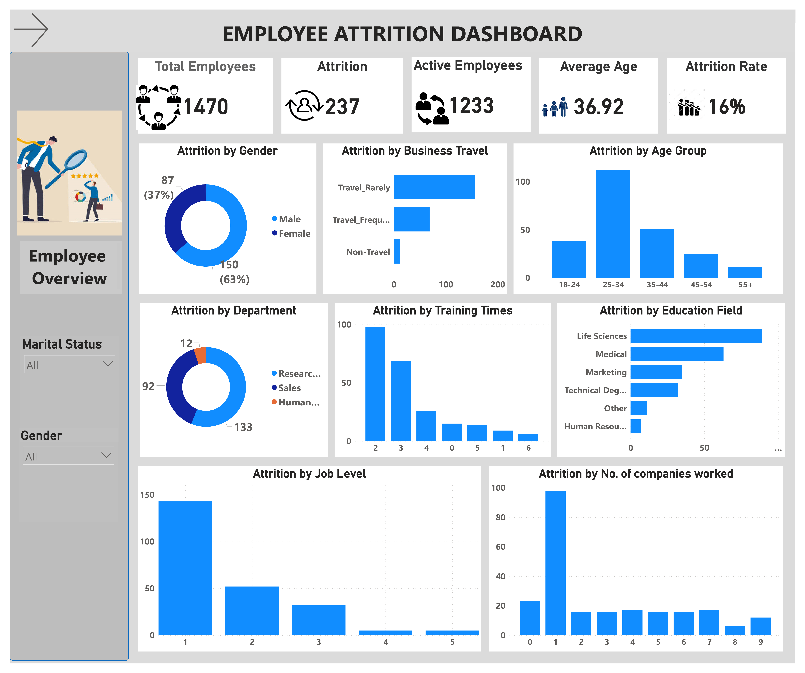

# HR Attrition Employee Report


## Background
Employee attrition, also known as staff turnover, measures the frequency at which employees leave a company during a specific timeframe. It's a vital HR metric that quantifies the percentage of departures, whether voluntary or involuntary and subsequent replacements. Voluntary attrition occurs when employees leave willingly, often due to factors like career growth, dissatisfaction, or better opportunities elsewhere. Involuntary attrition, on the other hand, involves employer-initiated departures such as layoffs or performance-related terminations. This project aims to assess attrition rates, identify key contributing factors, and propose strategies for reduction within the organization.

## About the Data
The dataset is a CSV file that contains one table, consisting of 1470 rows and 32 columns of the Employees hiring records and performance. The dataset can be found here.

## Business Problem
The following are some business questions this project seeks to assess:
1.  What is the overall attrition rate in the company?
2.	What is the average age of an Employee?
3.	How does attrition vary by age group?
4.	What is the overall attrition rate in the company?
5.	Is there a significant difference in attrition rates between different business travel categories (e.g., Travel Frequently, Rarely, Non-Travel)?
6.	Does gender play a role in attrition rates?
7.	Are there any noticeable patterns in attrition among employees of different education fields?
8.	Does marital status affect attrition rates?
9.	How does attrition vary across departments and job roles?
10.	Is there a correlation between years of service at the company and attrition?
11.	How does job satisfaction affect attrition?
12.	Are employees with a better work-life balance less likely to leave the company?
13.	Is there a relationship between monthly income and attrition

## Skills/ Concepts applied
The following skills and concepts were applied throughout the course of this project:
1.	Defining KPIs
2.	Cleaning/Validation in Power Query
3.	Power BI DAX Concepts: Calculated Measures
4.	Data Visualization in Power BI
5.	Power BI Dashboard building
6.	Filters and Slicers
7.	Insights & Actions

## Data Transformation / Cleaning
The dataset was imported into Power BI’s Power Query for data validation and cleaning.  ‘Column quality’ and ‘Column distribution’ checkboxes were selected to get summary information about each column for effective cleaning/Preprocessing. The processes are outlined below:
1.	Changed EmployeeNumber column to EmployeeId
2.	Deleted redundant columns ( 'EmployeeCount', 'StandardHours', 'Over18').
3.	Created an 'AgeGroup' column using the following DAX code:
 ```
AgeGroup = 
  SWITCH(
    		TRUE(),
    		'HR-Employee-Attrition'[Age] >= 18 && 'HR-Employee-Attrition'[Age] <= 24, "18-24",
   		'HR-Employee-Attrition'[Age] >= 25 && 'HR-Employee-Attrition'[Age] <= 34, "25-34",
    		'HR-Employee-Attrition'[Age] >= 35 && 'HR-Employee-Attrition'[Age] <= 44, "35-44",
   		 'HR-Employee-Attrition'[Age] >= 45 && 'HR-Employee-Attrition'[Age] <= 54, "45-54",
   		 'HR-Employee-Attrition'[Age] >= 55, "55+",
)

)
```

4.	Created an Attrition rate measure
 ```
  	Attrition Rate = ([Attrition] /'_Measures'[Total Employees])
 ```
   
5.	Created an Attrition measure

   ```
   Attrition = CALCULATE('_Measures'[Total Employees], 'HR-		Employee-            Attrition'[Attrition] = "Yes")
   ```

6.	Created an Active Employees measure
   ```
Active Employees = CALCULATE('_Measures'[Total Employees], 'HR-              Employee-Attrition'[Attrition] = "No")

   ```
 
7. Created a Total Employees measure
 ```
Total Employees = COUNT('HR-Employee-Attrition'[EmployeeId])
 ```

## Insights and Visualization
During data analysis, several key performance indicators (KPIs) were identified. The organization has a total workforce of 1470 employees, with 237 employees experiencing attrition, leaving 1233 active employees. The average age of employees is calculated to be 36.92 years, and the attrition rate stands at 16%.


Two dashboards have been designed to provide insights into the dataset. The first dashboard, known as "Employee Overview," focuses on analyzing employee demographics and key details, exploring their impact on employee attrition. The second dashboard, named "Employee Satisfaction," delves into the factors that contribute to employee satisfaction in both their job and overall life. Additionally, it examines how these factors may influence employee attrition.

## Employee Overview


## Employee Satisfaction


1.	Employees in the age group 25-34 had the highest attrition at 112, which was significantly higher (918.18%) than employees aged 55 and above (11 attritions)


  
2.	Singles had the highest Attrition at 120, followed by the Married at 84 and divorced at 33.


   
3.	Male employees had a higher attrition rate (150) compared to female employees (87).

 
   
4.	The job role "Laboratory Technician" had the highest attrition at 62, which was 416.67% higher than the job role "Human Resources" with the lowest attrition (12).
 
 
   
5.	Job satisfaction ranged from 46 to 73 across four levels.

 
  	
7.	In the "Life Sciences" education field, attrition was the highest at 89, significantly surpassing "Human Resources" with the lowest attrition at 7.
   

  	
8.	Employees with 1 year at the company had the highest attrition rate at 98, significantly higher than those with 8 years (the lowest at 6).
   

	
10.	Employees who have worked at 1 company had the highest attrition rate at 59, followed by those with 2 and 5 companies worked.
    


12.	At a relationship satisfaction level of 3, there was the highest attrition rate (71), which was 57.78% higher than level 2 with the lowest attrition (45).
    


13.	The highest attrition was observed when monthly income was at 2000, with 95 cases, followed by 4000 and 3000.
    


14.	At a work-life balance level of 3, there was the highest attrition rate (127), significantly higher than level 1 	with the lowest attrition (25).
    


15.	Travel_Rarely had the highest attrition at 156, followed by "Travel_Frequently" at 69, and "Non-Travel" at 12.
    
 
 
16.	Job Level 1 had the highest attrition at 143, followed by levels 2 and 3.
    


17.	Attrition ranged from 6 to 98 across different levels of training times last year.
    


18.	Research & Development had the highest attrition at 133, followed by "Sales" at 92, and "Human Resources" at 12.
    


## Recommendations
1.	Consider conducting surveys or assessments to understand the reasons for higher attrition in the 25-34 age group and implement targeted retention strategies
2.	Investigate the factors contributing to higher attrition among male employees and tailor retention efforts accordingly.
3.	Explore the work environment and job satisfaction specific to Laboratory Technicians to address attrition concerns.
4.	Focus on improving relationship satisfaction among employees to reduce attrition. Encourage open communication, provide support, and address workplace concerns.
5.	Investigate whether there are specific challenges or opportunities related to the Life Sciences field and tailor retention strategies accordingly.
6.	Consider offering competitive compensation packages and benefits to retain employees.
7.	Promote a healthy work-life balance through flexible work arrangements and stress management programs to reduce attrition among employees.
8.	Consider alternatives like remote work or reduced travel to address attrition concerns.
9.	Evaluate the effectiveness of training programs and align them with career development goals to improve employee retention.
10.	Explore why employees with just one year of tenure are leaving and consider onboarding and engagement strategies.
11.	Investigate whether there are patterns related to employees who have worked at multiple companies and develop strategies to retain them.
12.	Address career progression and development opportunities for employees at lower job levels to increase retention.
13.	Conduct surveys, exit interviews, and deeper analyses to uncover the root causes of attrition.


